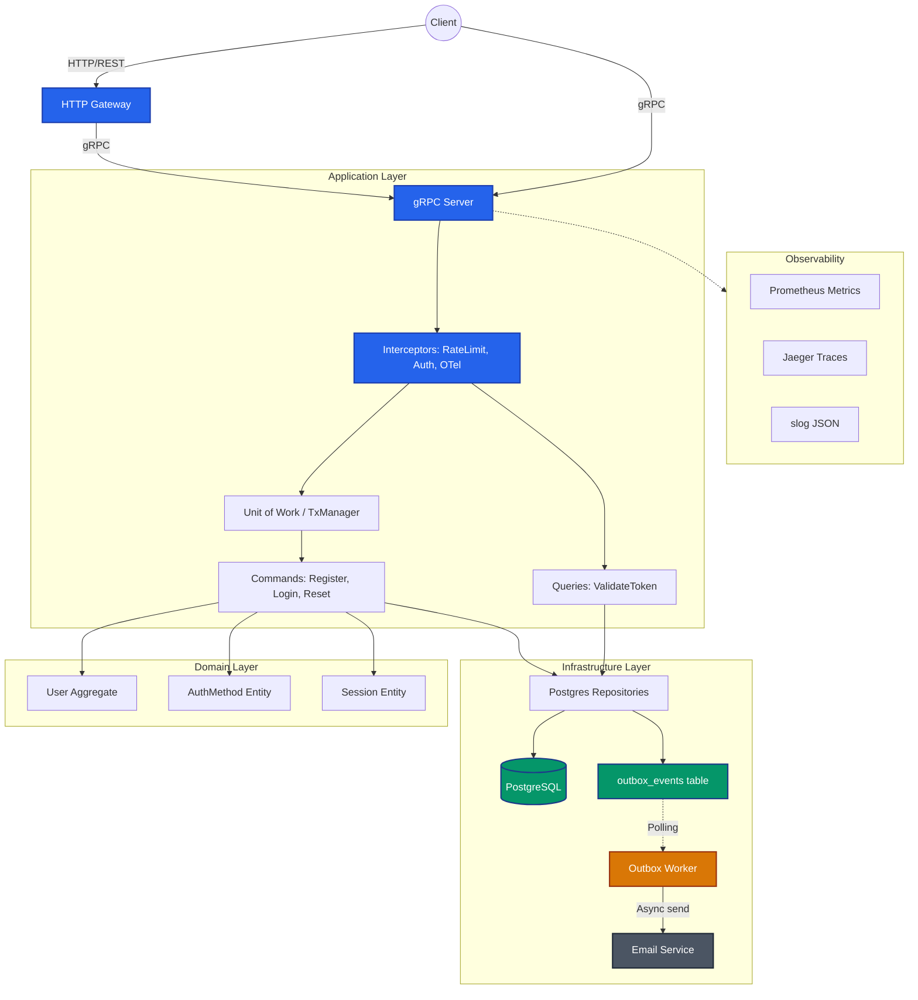

# Advanced Engineer Challenge

Привет, меня зовут Виктор, я Go-разработчик с опытом построения высоконагруженных систем в финтехе (антифрод) и e-commerce (системы управления пользователями).

В ходе выполнения этого проекта я преследовал не пустую ИИ-генерацию кода и бездумное следование баззвордам из ТЗ, а демонстрацию прагматичного инженерного подхода. Я отсек откровенный оверинжиниринг, аргументировал отказы и заложил фундамент, который можно полноценно развивать в будущем.

`UPD: в качетсве факультатива добавил небольшое фротенд приложение для тестирования полного флоу авторизации, регистрации и сброса пароля, посмотреть его можно в отдельной ветке - https://github.com/Vantany/engineer-challenge/tree/frontend`

## Реализованные сценарии

- **Регистрация** пользователей.
- **Авторизация** с выдачей пары JWT Access и Refresh токенов.
- **Восстановление пароля** (генерация токена и асинхронная отправка email).

## Архитектурные подходы

Пройдусь по самым спорным архитектурным требованиям и тому, какой вариант решения я использовал.

## 1. DDD

Как правило, аутентификация выступает в роли классического Generic Subdomain. Бизнес не зарабатывает на том, насколько уникально пользователь вводит пароль, поэтому избыточная доменная логика здесь часто ведет к оверинжинирингу. Тем не менее, для построения надежного фундамента я выделил Auth в строгий Bounded Context (Identity & Access). Главный акцент здесь сделан не на искусственном усложнении бизнес-правил, а на грамотной изоляции и расширяемости сущностей. В частности, корневой агрегат User изначально отвязан от конкретных способов входа (паролей).

### Границы контекста и Доменная модель

**Bounded Context:** `Identity & Access` (Управление аутентификацией и доступом).

- **`User` (Aggregate Root)** - Корневой агрегат. Владелец учетной записи. Не содержит пароля напрямую, оперирует только базовыми идентификаторами (ID, Email).
- **`Email` (Value Object)** - Базовый тип для представления адреса электронной почты.
- **`AuthMethod` (Entity)** - Сущность конкретного способа входа, привязанная к юзеру. Содержит тип (например, `password`) и сам хэш/идентификатор. У одного пользователя может быть несколько методов.
- **`Session` (Entity)** - Сущность активного сеанса устройства. Содержит хэш Refresh-токена, время жизни и флаг отзыва (активна/отозвана).
- **`ResetToken` (Entity)** - Сущность намерения сбросить пароль. Имеет строгий жизненный цикл (создан -> использован/протух).

### Бизнес-правила и инварианты

В рамках доменной модели строго соблюдаются следующие инварианты:

- **Политика паролей**: Пароли валидируются на уровне доменного сервиса (минимум 8 символов, спецсимволы, цифры, разный регистр).
- **Изоляция Credentials**: Агрегат User не хранит пароль напрямую. Пароль - это лишь одна из сущностей AuthMethod. Это архитектурное решение позволит легко добавить вход по OAuth2 или OpenID в будущем без изменения схемы БД и миграции пользователей.
- **Ротация токенов**: При каждом использовании Refresh токена его хэш в сессии обновляется, инвалидируя предыдущий токен, и выдается новая пара.
- **Ограничения на сброс пароля**: Токен восстановления является одноразовым и "протухает" через 15 минут. Дополнительно применяется Rate Limiting на уровне доменной логики: не более 3 попыток сброса для одного email в час.

## 2. API/протокол взаимодействия

В задании GraphQL упоминается как один из предпочтительных протоколов Однако его категорически не стоит выбирать для модуля авторизации - это буквально выстрел себе в ногу. Да, для публичного API с графом сущностей GraphQL великолепен, но мутации в GQL всегда возвращают HTTP 200 OK. В случае брутфорса условный Nginx этого не поймет, а инфраструктурный Rate Limiting полетит в трубу.

**Мое решение**: Строгий gRPC + HTTP Gateway (REST). Наружу торчат понятные эндпоинты (POST /api/v1/auth/login), которые отдают 401 Unauthorized и 429 Too Many Requests. Считаю, что главный best practice - это строить безопасную, предсказуемую и легко поддерживаемую систему.

## 3. CQRS

Если сделать «книжный» CQRS с разными базами данных (Write DB и Read DB) и асинхронной репликацией, мы получим Eventual Consistency. Для модуля авторизации это фатально: юзер должен иметь возможность залогиниться ровно в ту же миллисекунду, как успешно сбросил пароль.

**Мое решение**: CQRS только на сервисном слое. Command и Query хэндлеры строго разделены, но работают со строгой консистентностью в рамках БД.

## Архитектурная схема




**Структура проекта**

```text
.
├── api/                  # Protobuf контракты
├── cmd/
│   └── server/           # Точка входа, DI-контейнер (main.go)
├── deploy/
│   └── helm/             # Helm-чарты для деплоя в Kubernetes
├── docs/                 # Swagger
├── internal/
│   ├── config/           # Парсинг конфигурации (ENV)
│   ├── domain/           # Бизнес-логика, агрегаты, сущности (User, Session)
│   ├── infrastructure/   # Реализация интерфейсов (PostgreSQL, JWT, Email, Tracing)
│   ├── logger/           # Настройка логгера
│   ├── transport/        # gRPC и HTTP/REST контроллеры (Gateway), Rate Limiter, Middleware
│   ├── usecase/          # Сценарии использования (CQRS: Commands / Queries)
│   └── worker/           # Фоновые воркеры (Transactional Outbox)
├── migrations/           # SQL миграции базы данных (Goose)
└── tests/                # E2E и интеграционные тесты
```


## Технологический стек

- **Язык**: Go 1.25 (высокая производительность, встроенная поддержка конкурентности, простота, минимум сторонних зависимостей + я go разраб)
- **Транспорт**: gRPC + HTTP Gateway (дает строгий типизированный контракт + REST-совместимый API для фронтенда)
- **БД**: PostgreSQL (ACID, транзакции, надежность, стандарт индустрии)
- **Инфраструктура**: Docker Compose, миграции через Goose (простые SQL-миграции без ORM-магии, легко встраиваются в CI/CD)
- **Observability**: OpenTelemetry (трейсы), Prometheus (метрики), структурированные логи

### Рассмотренные альтернативы

- **PostgreSQL vs MongoDB (NoSQL)**: Для модуля Identity Provider и управления доступом критически важны строгие ACID-гарантии. Мы не можем позволить себе потерять данные о регистрации или столкнуться с проблемами консистентности паролей. Реляционная модель Postgres с транзакциями идеально подходит для этих задач, тогда как NoSQL базы здесь скорее навредят.
- **Goose vs ORM Auto-migrations (например, GORM)**: Использование автомиграций из ORM в проде - это бомба замедленного действия. Они могут случайно удалить колонку, залочить таблицу на полчаса или создать неоптимальный индекс. `Goose` дает полный ручной контроль над DDL-запросами через простые и понятные `.sql` файлы.
- **easyp vs buf / protoc**: Самый простой вариант кодогенерация gRPC является `protoc` (с кучей флагов и проблем с путями) или `buf` (отличный, но тяжеловесный инструмент). Я выбрал `easyp` как современную, легкую и быструю альтернативу от ребят из Озона, которая позволяет описать конфигурацию генерации (включая gateway и openapi) в одном простом YAML файле без сложных зависимостей.

## Безопасность

- **Хранение учетных данных**: Никакого plaintext. Пароли хэшируются через `bcrypt` (cost=12). Логика скрыта за интерфейсом `PasswordPolicy`, что позволяет при необходимости бесшовно мигрировать на другие алгоритмы хэширования (например, `Argon2id`) без изменения доменной логики.
- **Защита от перебора и брутфорса (A04: Insecure Design)**:
  - Реализован in-memory Rate Limiter на уровне HTTP-middleware и gRPC-интерцепторов. Установлен жесткий лимит на эндпоинт Login - 5 запросов в минуту.
  - Сброс пароля лимитируется на уровне бизнес-логики: максимум 3 попытки в час для одного email.
- **User Enumeration (Перечисление пользователей)**: Эндпоинты не раскрывают, существует ли пользователь в базе. При неверном пароле всегда возвращается универсальная ошибка `Invalid Credentials`. Запрос на сброс пароля для несуществующего email также не выдает ошибку, предотвращая сканирование базы.
- **Защита сессий и ротация токенов**: Внедрен механизм *Refresh Token Rotation*. При каждом обновлении токена (Refresh) старый хэш в базе перезаписывается новым. Если злоумышленник украдет старый Refresh-токен и попытается им воспользоваться, система не найдет сессию по старому хэшу и откажет в доступе. Любая сессия может быть отозвана, блокируя дальнейший выпуск Access-токенов.
- **Асимметричная подпись токенов (RS256)**: Access-токены (JWT) подписываются приватным RSA-ключом. Внешним микросервисам для валидации токена достаточно получить публичный ключ. Это полностью исключает риск компрометации единого симметричного секрета (как в случае с HS256) при масштабировании системы.

## Trade-offs

- **Гарантия консистентности: Unit of Work + Transactional Outbox**
Для Identity-провайдера компромисс в виде Eventual Consistency недопустим. Например, операция запроса на сброс пароля (RequestPasswordReset) включает в себя мутацию в БД (сохранение токена) и сайд-эффект (отправку письма). Ожидать ответа от внешнего SMTP-сервера синхронно нельзя - это ведет к долгим ответам API и отказам при сетевых задержках.

> **Решение:** Применен паттерн Unit of Work. Сохранение токена и события в outbox происходит строго в рамках одной ACID транзакции. Отдельный воркер читает события и отправляет письма. Это дает 100% гарантию консистентности без внедрения тяжеловесных брокеров сообщений вроде RabbitMQ или Kafka.

- **Observability-First подход**
Система в production слепа без качественной телеметрии. Я проектировал сервис так, чтобы он был полностью прозрачным для эксплуатации с первого дня.

> **Решение:** Внедрен OpenTelemetry (трейсинг через Jaeger) и метрики (счетчики, ошибки, гистограммы latency через Prometheus). Также я написал кастомный логгер на базе `slog`, который прикрепляет `trace_id` и `request_id` к логам и не "проглатывает" реальные причины ошибок.

- **PostgreSQL для сессий (а не Redis)**
Да, хранить сессии в Redis модно и лучше `в перспективе`. Но чтобы убрать лишнюю инфраструктурную зависимость на начальном этапе, я ограничился использованием PostgreSQL. При росте нагрузок, благодаря чистой архитектуре, мы просто напишем `redis_session_repository`, не трогая бизнес-логику.
- **Миграции: CI/CD Job vs Накат при старте**
Я сознательно не стал встраивать автоматический накат миграций в старт приложения. В мире микросервисов и горизонтального масштабирования накат миграций при старте пода - это жесткий антипаттерн:
  1. Состояние гонки: 5 подов стартуют одновременно и пытаются заблокировать базу для наката. Даже с advisory locks это лишняя нагрузка и риск.
  2. Downtime: Если миграция тяжелая (создание индекса или изменение типа колонки), под будет висеть, не отвечая на healthcheck'и, и кубер его просто убьет.
  3. Безопасность: Приложение в проде должно иметь только DML-права (CRUD), а не DDL (CREATE/DROP). Хранить креды с админскими правами в конфиге рабочего сервиса - дыра.

>   **Решение:**
>
> 1. Миграции должны накатываться отдельной одноразовой Kubernetes Job'ой *строго до* начала деплоя новых подов. 
> 2. Миграции обязаны быть обратно совместимыми. Нельзя просто дропнуть колонку. Нужно действовать в несколько фаз: сначала выкатываем код, который перестает читать эту колонку (но пишет в обе), затем код, который полностью от нее отвязывается, и только в следующем релизе накатываем миграцию `DROP COLUMN`.

>  Сейчас для эмуляции внешнего наката используется `Makefile`.

- **IaC: Docker Compose**
В репозитории лежит Compose для локальной операбельности. Но сервис полностью соответствует методологии 12-Factor App - конфигурация не зашита в файлы (никаких config.yaml), а прокидывается через ENV (.env.example). Это делает сервис готовым к накатыванию через Helm.
- **IaC: Helm**  
В `deploy/helm` лежит полноценный Helm-чарт для деплоя auth-service. Конфигурация Managed БД и ключи безопасно инжектятся через переменные окружения.

## Пространство для эволюции

Архитектура закладывалась с учетом того, как проект будет развиваться завтра:

- **Fintech и OAuth2**: Судя по по описанию и референсам из фигмы, это финтех. Голая парольная авторизация выглядит как антипаттерн. Поэтому я не стал хардкодить пароль в агрегат User. Пароль - это лишь сущность AuthMethod. Завтра понадобится вход по OpenID или Auth 2.0? Мы просто добавим новый AuthMethod без тяжелых миграций БД и без боли для текущих юзеров.
- **Управление устройствами**: Сейчас сессии просто хранятся в БД для проверки инвалидации. Логичное развитие - начать сохранять метаданные устройств (User-Agent, IP, отпечаток) и реализовать эндпоинт GET /sessions. Это позволит пользователю в UI видеть свои активные сеансы и безопасно делать "Завершить все другие сеансы".
- **Backward Compatibility**: Использование gRPC позволяет добавлять новые поля в контракты без поломки старых клиентов. А REST-шлюз версионирован (/api/v1/), что позволяет мягко переводить фронтенд на новые ревизии API.
- **MFA и Step-up Auth**: Сущность Session готова к расширению. В будущем туда можно добавить уровень доверия, чтобы при нетривиальных сценариях запрашивать у юзера 2FA.

## API Документация (Swagger)

Так как под капотом используется gRPC-Gateway, мы получаем приятный бонус в виде автогенерируемой OpenAPI/Swagger документации из `.proto` контрактов. 
Сам файл с актуальным контрактом генерируется в `docs/swagger/api/auth/v1/auth.swagger.json`. Его можно легко скормить в любой Swagger UI или Postman для тестирования REST-ручек.

## Как запускать локально (Docker Compose)

Запуск максимально упрощен через `Makefile`. 

1. Клонируем репозиторий:

```bash
git clone <url>
cd engeneer-challenge
```

1. Генерируем RSA-ключи для подписи JWT:

```bash
make gen-keys
```

1. Поднимаем всё одной командой (базу, миграции, сервис, обсервабилити):

```bash
make up
```

*Под капотом `make up` поднимет базу данных, накатит на неё миграции через отдельный init-контейнер и только после этого запустит сам `auth-service`.*

Сервис будет готов принимать трафик на:

- **HTTP REST:** `localhost:8080`
- **gRPC:** `localhost:9090`
- **Prometheus метрики:** `localhost:8081/metrics`
- **Jaeger UI:** `http://localhost:16686`

**Полезные шорткаты:**

- `make logs` - просмотр логов сервиса
- `make down` - полная остановка и удаление контейнеров

## Helm

Для работы с кубером подготовлен Helm-чарт (`deploy/helm/auth-service`). 

Для локального тестирования чарта в Minikube/Kind можно использовать команду:

```bash
make deploy
```

## Примеры запросов (REST & gRPC)

Сервис одновременно обслуживает REST и gRPC запросы.

Регистрация (REST HTTP):

```bash
curl -X POST http://localhost:8080/api/v1/auth/register \
  -H "Content-Type: application/json" \
  -d '{"email": "user@example.com", "password": "Password123!"}'
```

Логин (gRPC через grpcurl):

```bash
grpcurl -plaintext -d '{"email": "user@example.com", "password": "Password123!"}' \
  localhost:9090 auth.v1.AuthService/Login
```

Валидация токена (REST HTTP):

```bash
curl -X POST http://localhost:8080/api/v1/auth/validate \
  -H "Authorization: Bearer <access_token>" \
  -H "Content-Type: application/json" \
  -d '{}'
```

`Полная документация автоматически генерируется на основе .proto контрактов и доступна в docs/swagger/api/auth/v1/auth.swagger.json.`

## Тестирование

- Unit-тесты: лежат idiomatic-способом рядом с доменными моделями (_test.go), тестируют чистую логику 
(политики паролей, правила истечения токенов).
- Integration-тесты: поднимают реальный PostgreSQL через testcontainers-go. Проверяют, как адаптеры работают 
с базой и как Transaction Manager честно откатывает транзакции при ошибках.

### Запуск Unit и Integration тестов (поднимет базу через testcontainers):

```bash
make test
```

