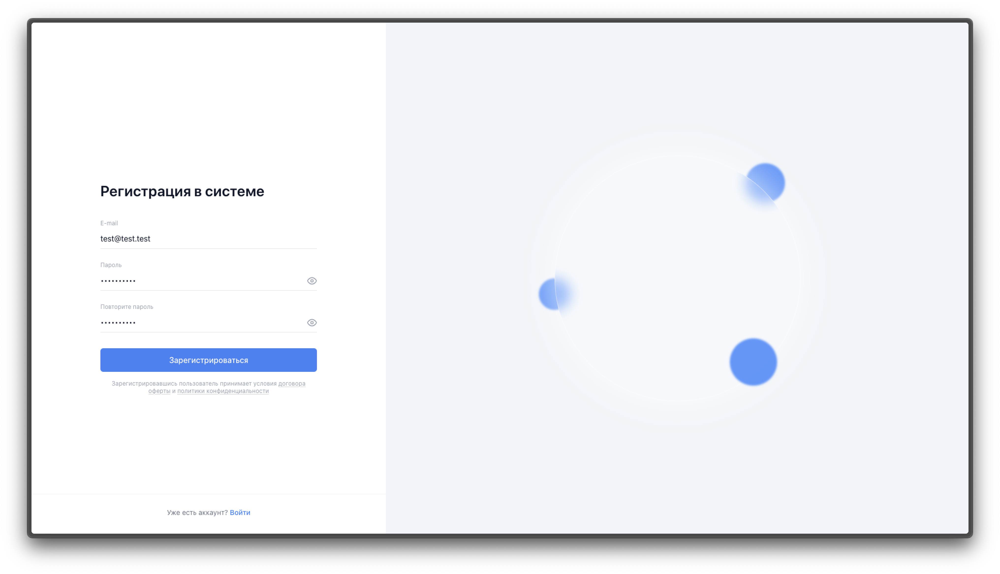
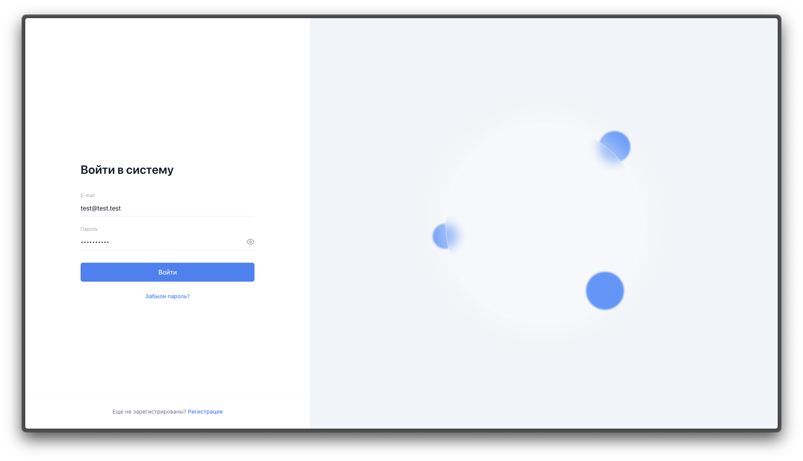
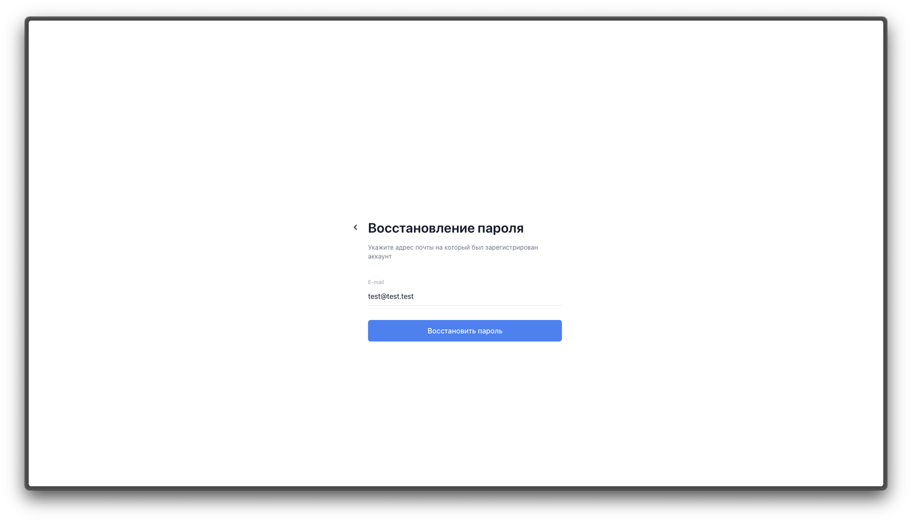
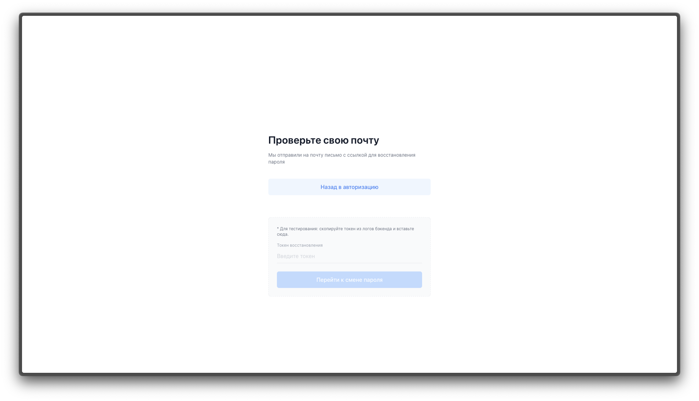
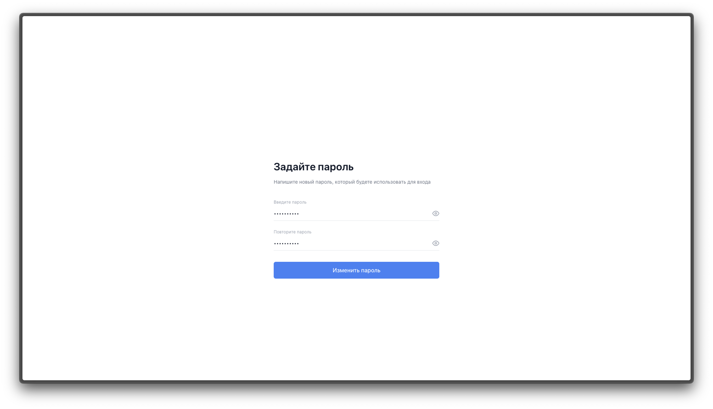
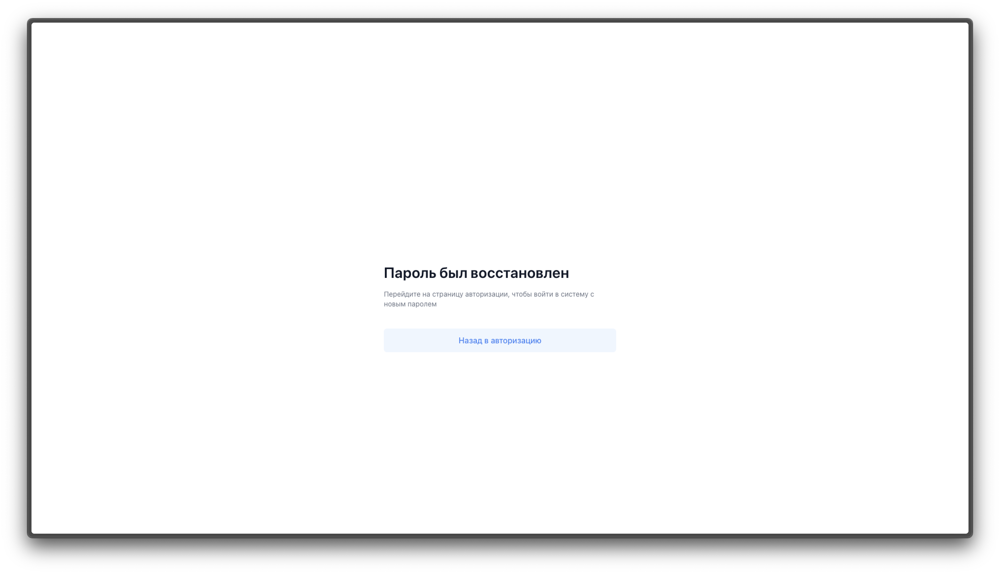
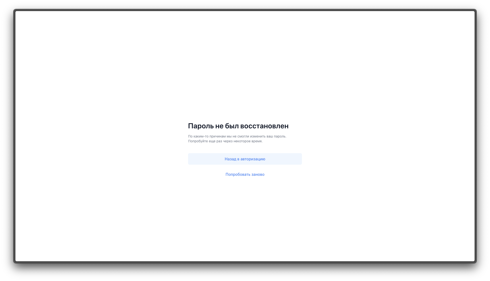

# Advanced Engineer Challenge

Для наглядного тестирования полного флоу работы сервиса я добавил небольшое фронтенд-приложение на TypeScript. Визуальная часть была полностью реализована с помощью ИИ на основе предоставленных макетов из фигмы. Поскольку моя основная экспертиза это бэкенд, то фронтенд здесь выступает скорее как proof-of-concept. Тем не менее, он отлично справляется со своей главной задачей и наглядно демонстрирует, что вся бэкенд-логика (регистрация, авторизация, восстановление пароля) отрабатывает правильно.

## Как запустить проект (Docker Compose)

Запуск максимально упрощен через `Makefile`. 

1. Клонируем репозиторий:
```bash
git clone <url>
cd engeneer-challenge
```

2. Поднимаем всё одной командой (базу, миграции, бэкенд, фронтенд):
```bash
docker compose up
```

После запуска фронтенд будет доступен по адресу: **http://localhost:5173**

## Флоу тестирования

Ниже описан полный сценарий использования системы, который вы можете пройти в браузере.

### 1. Регистрация (`/register`)

Для начала работы необходимо создать аккаунт.
- Перейдите на страницу регистрации по ссылке снизу экрана входа.
- Введите email и пароль (пароли должны совпадать, пароль должен быть надежным).
- После успешной регистрации вас автоматически перенаправит на экран входа.



### 2. Авторизация (`/login`)

- Введите данные, указанные при регистрации.
- Бэкенд проверит данные и вернет пару токенов (Access и Refresh).
- При успешном входе появится уведомление, и вас перенаправит на защищенную страницу-заглушку (`/dashboard`).



### 3. Восстановление пароля

Если пользователь забыл пароль, предусмотрен безопасный флоу восстановления.

**Шаг 3.1: Запрос на восстановление (`/forgot-password`)**
- Нажмите "Забыли пароль?" на экране входа.
- Введите email, на который был зарегистрирован аккаунт, и отправьте форму.



**Шаг 3.2: Проверка почты (`/check-email`)**
- Вас перекинет на экран с просьбой проверить почту.
- **Важно для тестирования:** Так как реальные письма на почту не отправляются, на этом экране предусмотрено специальное поле. Откройте логи бэкенда (`make logs`), найдите сгенерированный токен восстановления, вставьте его в это поле и нажмите "Перейти к смене пароля".



**Шаг 3.3: Установка нового пароля (`/set-password`)**
- На этом экране введите новый пароль. Токен из предыдущего шага автоматически подставится в URL и будет отправлен на бэкенд.



**Шаг 3.4: Результат**
- Если токен валиден и не протух, вы увидите экран **успешного восстановления** (`/password-recovered`) и сможете вернуться к авторизации.
- Если токен неверный или время его жизни истекло, вы увидите экран **ошибки** (`/password-not-recovered`) с возможностью попробовать заново.


